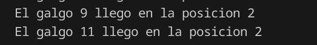
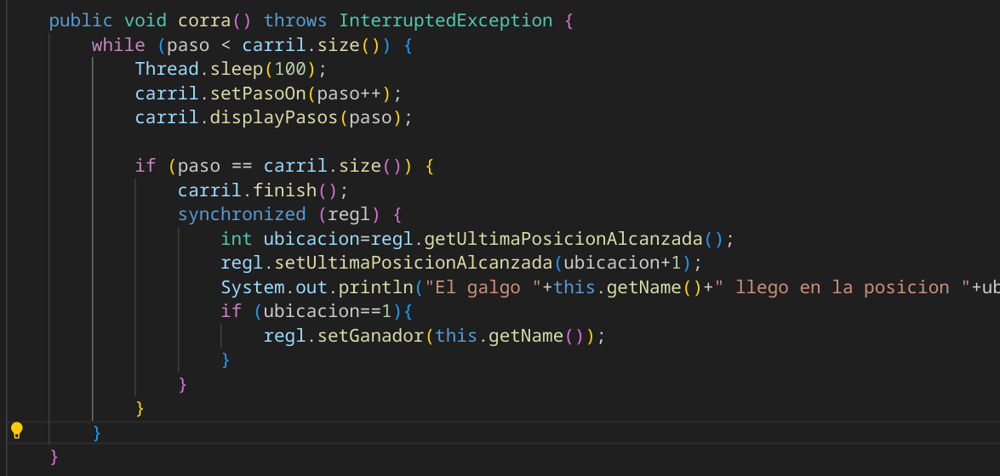

# ARSW_LAB2
Programación concurrente, condiciones de carrera y sincronización de hilos

## Instrucciones de ejecución

Para ejecutar cualquiera de las partes del laboratorio, sigue estos pasos desde la terminal:

### Parte 1 (Primos Concurrentes)

```bash
cd parte1
mvn clean package
mvn exec:java
```

### Parte 2 (Carrera de Galgos)

```bash
cd parte2
mvn clean package
mvn exec:java
```

> Asegúrate de tener Maven instalado y configurado

# Parte I
### 1. Usando el hilo principal con primos de 0 a  500.000.000 


###  2. Modificamos el codigo para poder crear n hilos 


### 2.1 Usando 3 hilos sin sincronizar

####

### 3.

 Modificamos la aplicación de manera que cuando hayan transcurrido 5 segundos desde que se inició la ejecución, se detengan todos los hilos y se muestre el número de primos encontrados hasta el momento. Luego, se debe esperar a que el usuario presione ENTER para reanudar la ejecución de los mismo.


La salida que obtenemos es:

```

The last prime found was: 12046717
170858407
Thread Pause
336340757
The last prime found was: 170858407
Thread Pause
The last prime found was: 336340757
Press the ENTER key to continue

```

# Parte II


### 1. Problemas iniciales

Al iniciar la simulación, los resultados (ranking y ganador) pueden mostrarse antes de que todos los galgos terminen la carrera. Además, pueden presentarse inconsistencias en el ranking, como posiciones repetidas:



---

### 2. Identificación y corrección de la región crítica

La región crítica es el acceso y modificación del objeto compartido `RegistroLlegada`, donde se asigna la posición de llegada a cada galgo.  
Para evitar condiciones de carrera, se sincronizó el acceso a este objeto usando `synchronized(regl)`:



Esto garantiza que solo un galgo a la vez pueda actualizar la posición de llegada y el ganador, evitando posiciones repetidas o saltadas.

---

### 3. Pausa y reanudación de la carrera

Se implementaron los métodos `pause()` y `resume()` en la clase `Galgo`, usando un flag y `wait()` , `notifyAll()`. Cuando se hace clic en ‘Stop’, todos los hilos se detienen en la siguiente iteración; al hacer clic en ‘Continue’, todos se reanudan.

**Implementación de pausa y reanudación en los galgos:**

Para permitir pausar y reanudar la carrera, se agregaron los siguientes métodos en la clase `Galgo`:

```java
public void pause() {
    paused = true;
}

public void resume() {
    synchronized (this) {
        paused = false;
        notifyAll();
    }
}
```

- `pause()` establece el flag `paused` en `true`, lo que hace que el hilo se detenga en la siguiente iteración del ciclo.
- `resume()` pone el flag en `false` y llama a `notifyAll()` dentro de un bloque `synchronized`, permitiendo que el hilo continúe su ejecución.

Dentro del método `corra()`, se verifica el flag `paused` en cada iteración:

```java
while (paso < carril.size()) {
    synchronized (this) {
        while (paused) {
            wait();
        }
    }
}
```

Esto garantiza que los galgos pueden ser pausados y reanudados de manera segura y controlada durante la simulacion.


---

### 4. Resultados

Después de aplicar la sincronización y la lógica de pausa/reanudación, la simulación muestra resultados consistentes y permite controlar la ejecución de los galgos de forma segura.


## Conclusiones

- La sincronización de regiones críticas es fundamental para evitar condiciones de carrera en aplicaciones concurrentes.
- El uso correcto de `wait()` y `notifyAll()` junto con `synchronized` permite implementar mecanismos de pausa y reanudación efectivos en hilos.
- Sin sincronización, los resultados pueden ser inconsistentes y no reproducibles.

---

Autor Juan Andres Rodriguez Peñuela.
