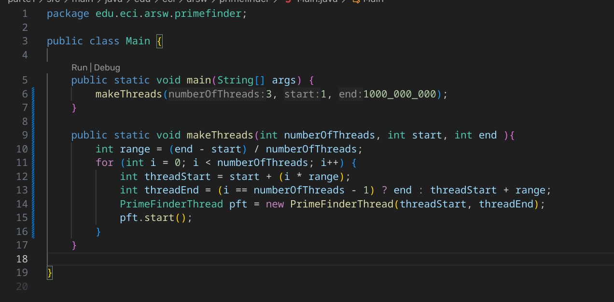
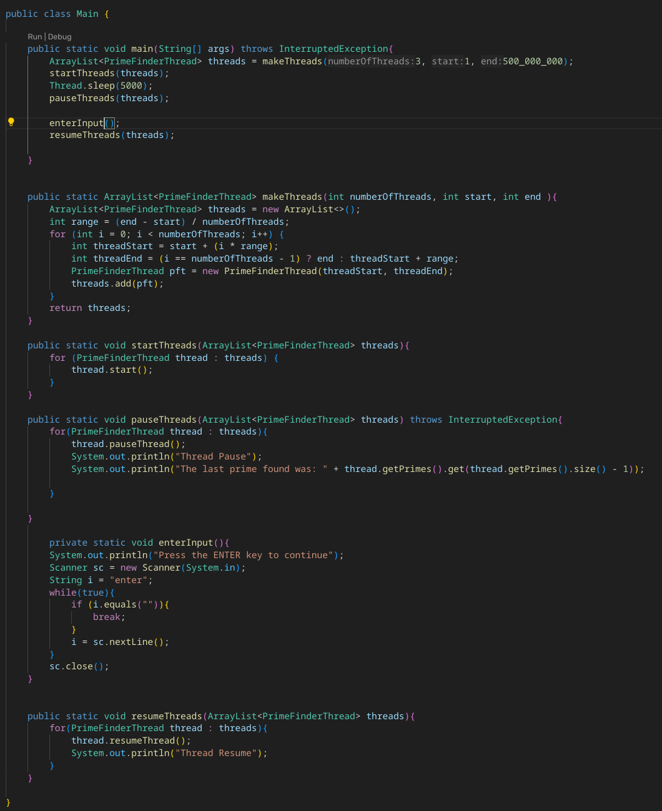

# ARSW_LAB2
Programación concurrente, condiciones de carrera y sincronización de hilos

# Parte I
### 1. Usando el hilo principal con primos de 0 a  500.000.000 


###  2. Modificamos el codigo para poder crear n hilos 



### 2.1 Usando 3 hilos sin sincronizar

####

### 3.

 Modificamos la aplicación de manera que cuando hayan transcurrido 5 segundos desde que se inició la ejecución, se detengan todos los hilos y se muestre el número de primos encontrados hasta el momento. Luego, se debe esperar a que el usuario presione ENTER para reanudar la ejecución de los mismo.




La salida que obtenemos es:

```

The last prime found was: 12046717
170858407
Thread Pause
336340757
The last prime found was: 170858407
Thread Pause
The last prime found was: 336340757
Press the ENTER key to continue

```

# Parte II
